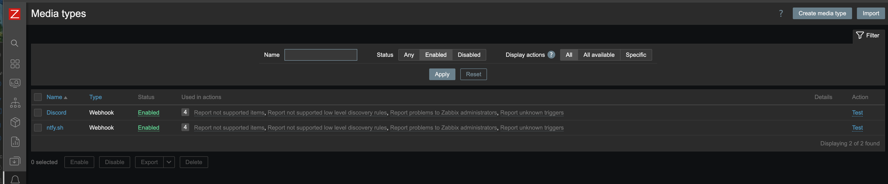
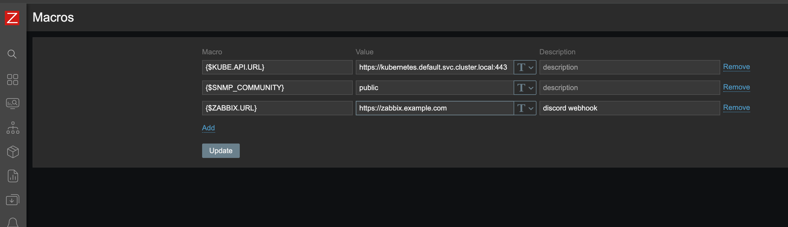
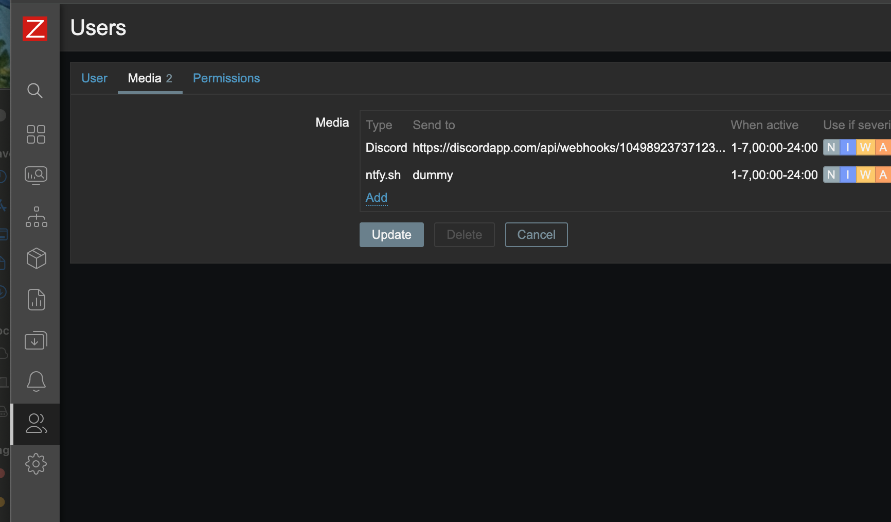

# zabbix-ntfy 🚀 (v1.1.0)
**Want to send notifications from Zabbix to your phone or desktop?** 📱💻

This is a Mediatype to add support for [ntfy.sh](https://ntfy.sh/) notifications into [Zabbix](https://www.zabbix.com/).

I'm using this integration with the ntfy apps for [iOS](https://apps.apple.com/nl/app/ntfy/id1625396347) and [Android](https://play.google.com/store/apps/details?id=io.heckel.ntfy). There are also several projects available for desktop notifications if you prefer to receive alerts on your computer.

> **Note:** This project was originally created for my personal setup, but I’m more than happy to receive pull requests! A huge thanks to everyone who has already contributed code and improvements. 🙏 
> 
> Please keep in mind that this is a hobby project fueled by spare time and curiosity. Since I don't have a dedicated QA department (it's just me), I have limited bandwidth to test every single commit or provide 24/7 support. Everything is handled on a **Best Effort™** basis—I’ll do my best to help out between coffee breaks and my real life! ☕🚀

## Setup 🛠️
1. Download the `zbx_ntfy.yaml` file.
2. In Zabbix, go to **Alerts -> Media types** and click **Import**.

### Configuration (Global Macros) ⚙️
Go to **Administration -> Macros** and create the following macros to define your ntfy instance:

| Macro | Description | Requirement |
| :--- | :--- | :--- |
| `{$NTFY.URL}` | The URL to your ntfy instance (e.g., `https://ntfy.sh`). | **Required** |
| `{$NTFY.SENDTO}` | Global topic name for all alerts. | Optional |
| `{$NTFY.TOKEN}` | Auth token for ntfy (Bearer). | Optional |
| `{$ZABBIX.URL}` | URL to your Zabbix instance for clickable links. | Optional |

### User Settings 👤
Go to **Users -> Users**, select your user, and navigate to the **Media** tab.
1. Add the **ntfy.sh** media type.
2. The **Send to** field must be populated. If you are using the global topic macro, you can just enter `dummy`.

## Troubleshooting 🔍
If notifications are not arriving, check the Zabbix Server logs (usually `/var/log/zabbix/zabbix_server.log`).

| Error Message | Possible Cause |
| :--- | :--- |
| `Cannot get ntfy url!` | The macro `{$NTFY.URL}` is missing or empty. |
| `Nseverity value must be passed as an int` | Internal Zabbix error where severity mapping failed. |
| `Sending failed: HTTP/1.1 401 Unauthorized` | Invalid Token or Username/Password. |
| `Sending failed: HTTP/1.1 404 Not Found` | The Topic name or ntfy URL is incorrect. |

## Official Mentions & Community 🌍
This project is recognized and featured in the following locations:
* **ntfy.sh Documentation**: Listed under [Integrations / Projects + scripts](https://docs.ntfy.sh/integrations/#projects-scripts).
* **Zabbix Cookbook**: Discussed on the [Official Zabbix Forum](https://www.zabbix.com/forum/zabbix-cookbook/475107-how-to-add-the-ntfy-sh-notification-service-as-media-type-in-zabbix).

## Honorable Mentions 🏅
* **PaulSorensen**: A special thanks for his excellent work on his fork. Several features in v1.1.0 (emoji tagging, security logging, and HTTP status checks) were backported from his repository to improve the core experience for everyone.

---
*Happy monitoring!* 📈
